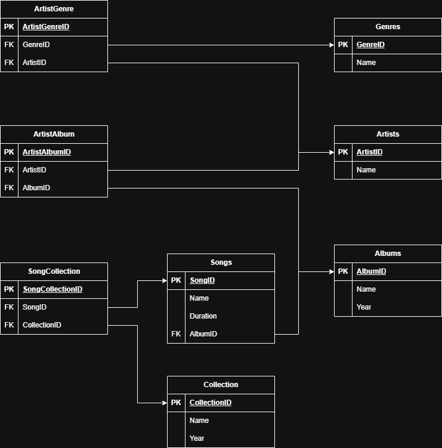

# Таблицы и связи

## 1. Схема для нескольких отношений «Сотрудник». 

У каждого сотрудника есть следующие параметры:
- имя;
- отдел;
- начальник (ссылка на начальника).
Примечание: начальник — тоже сотрудник.

[SQL-запросы](./employee/employee_script.sql)

## 2. Схема спроектирована для музыкального сайта

Требования:
- на сайте должна быть возможность увидеть список музыкальных жанров;
- для каждого жанра можно получить список исполнителей, которые выступают в соответствующем жанре;
- для каждого исполнителя можно получить список его альбомов;
- для каждого альбома можно получить список треков, которые в него входят;
- у жанра есть название;
- у исполнителя есть имя (псевдоним) и жанр, в котором он исполняет;
- у альбома есть название, год выпуска и его исполнитель;
- у трека есть название, длительность и альбом, которому этот трек принадлежит.

## 3. Изменённая схема для музыкального сайта

Требования:
- исполнители теперь могут петь в разных жанрах, как и одному жанру могут принадлежать несколько исполнителей;
- альбом могут выпустить несколько исполнителей вместе;
- исполнитель может принимать участие во множестве альбомов;
- трек всё так же принадлежит строго одному альбому;
- появилась новая сущность — сборник. Сборник имеет название и год выпуска. В него входят различные треки из разных альбомов;
- один и тот же трек может присутствовать в разных сборниках.

[SQL-запросы v1](./music/music_upgrade_script_v1.sql)

[SQL-запросы v2](./music/music_upgrade_script_v2.sql)
